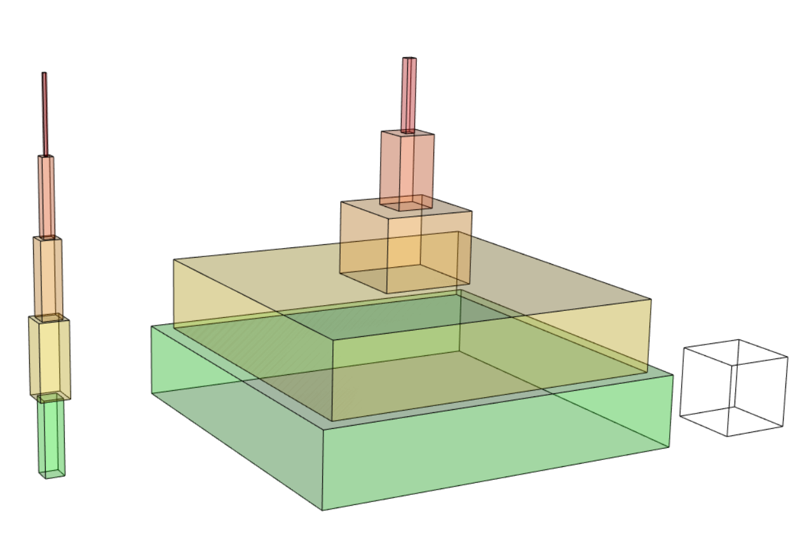
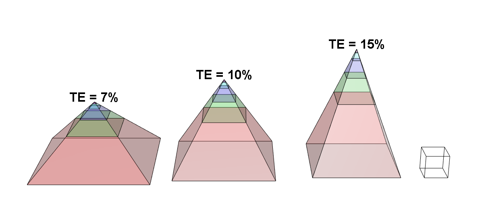

<!-- README.md is generated from README.Rmd. Please edit that file -->
EwEvis
======

Ecopath with Ecosim (EwE) visualization. Allows for the creation of 3d visualizations of biomass and throughput statistics.

**Includes**:

-   3d trophic pyramid. Angle is inversely proportional to mean transfer efficiency (TE) and volume represents either biomass or throughput by trophic level.
-   3d stacked boxes. Volume represents either biomass or throughput by trophic level.

**To load** (using `devtools`):

    library(devtools)
    install_github("marchtaylor/EwEvis")

**Examples:** (for additional info and interactive graphics, see [vignette](https://rawgit.com/marchtaylor/EwEvis/master/vignettes/EwEvis_vignette.html))

*Vbox3d()* - Biomass and Throughput by trophic level

*Vpyramid3d()* - Throughput by trophic level with differing mean transfer efficiency (TE)
